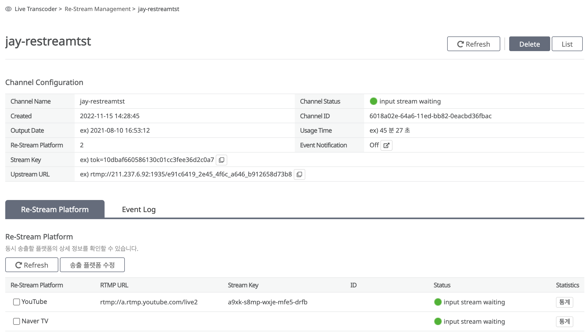

# Re-stream Management

* 수신한 라이브영상 신호를 Youtube, NaverTV 등 스트리밍 서비스 플랫폼으로 재 전송하기 위해 Re-stream 채널을 개설 합니다.&#x20;

## Channel Create

* 리스트리밍 서비스 채널을 개설합니다. 채널 개설 절차는 다음과 같습니다.

> * 'Create Channel' 버튼을 눌러 채널 개설 설정을 시작합니다.
> * Re-Stream Channel 설정을 진행합니다.
> * 설정한 정보를 확인하고 채널 개설을 진행 합니다.&#x20;


Re-Stream 채널 생성을 위한 Device는 최소 사양인 'BL2.4x8'이 생성되며, 생성 후 해당 Device 사용에 따른 기본 요금이 과금 됩니다. 자세한 과금정책은 서비스 포털의 Price 페이지를 참조하시길 바랍니다.

따라서, 장시간 사용하지 않을 경우 채널을 삭제하시길 바랍니다.


<figure><figcaption></figcaption></figure>

### Step1: Re-Stream Channel 설정.

<figure><figcaption></figcaption></figure>

설정항목

<table><thead><tr><th>설정항목</th><th>설명</th><th data-hidden></th></tr></thead><tbody><tr><td>Channel Name</td><td>Channel 이름.</td><td></td></tr><tr><td>Event Notification</td><td>
Event 알람 설정 상태.
<ul><li>On: 이벤트 알람 수신.</li><li>Off: 이벤트 알람 수신하지 않음.</li></ul></td><td></td></tr><tr><td>Re-Stream Platform</td><td>리스트리밍할 대상 플랫폼 정보 설정.</td><td></td></tr><tr><td>Youtube</td><td>Youtube 선택 시 수신되는 라이브 영상을 Youtube로 재 전송합니다. </td><td></td></tr><tr><td>Naver TV</td><td>Naver TV 선택시 수신되는 라이브 영상을 Naver TV로 재 전송합니다. </td><td></td></tr><tr><td>                       RTMP URL</td><td>수신한 라이브 원본 동영상을 재 전송하는  대상 플랫폼의  URL. (RTMP Push)</td><td></td></tr><tr><td>                       Stream Key</td><td>RTMP Push로 라이브 원본 동영상을 대상 플랫폼으로 입수시키기 위한 Stream Key</td><td></td></tr></tbody></table>


리스트리밍 서비스를 사용하기 위해서는 먼저 리스트리밍 대상 플랫폼(Youtube, Naver TV 등)에서 라이브 스트리밍 서비스 채널을 개설하고, 해당 채널의 스트림 인입(Upstream) 정보(RTMP URL, Stream Key)를 확인해서 설정을 완료하여야 합니다.&#x20;


#### Step2. Final Check & Create Channel

앞서 설정한 Re-Stream Channel 설정 정보를 확인하고, 'Create Re-Stream Channel' 버튼을 클릭하여 채널 개설을 완료합니다. 채널 개설 완료까지 6\~10분 가량 소요됩니다.

<figure><figcaption></figcaption></figure>

## Channel Lists

<figure><figcaption></figcaption></figure>

### Search

리스트리밍 서비스 채널 이름으로 생성한 채널을 검색하실 수 있습니다.

### 제공항목

<table><thead><tr><th>제공항목</th><th>설명</th><th data-hidden></th></tr></thead><tbody><tr><td>Channel Name</td><td>Channel 이름.</td><td></td></tr><tr><td>Re-Stream Platform</td><td>리스트리밍 서비스를 제공하는 대상 플랫폼의 수.</td><td></td></tr><tr><td>Channel Status</td><td>
라이브 리스트리밍 서비스 채널의 상태
<ul><li>Input stream waiting: 채널 생성 후 라이브 영상 입력 대기 상태.</li><li>In Progress: 채널 구성 진행 중.</li><li>On-Air: 라이브 영상 송출 중.</li><li>Off-Air: 라이브 영상 송출 완료.</li></ul></td><td></td></tr><tr><td>Event</td><td>
Event 알람 설정 상태
<ul><li>On: 이벤트 알람 수신.</li><li>Off: 이벤트 알람 수신하지 않음.</li></ul></td><td></td></tr></tbody></table>

## Channel Details

<figure><figcaption></figcaption></figure>

### 제공항목

<table><thead><tr><th>제공항목</th><th>설명</th><th data-hidden></th></tr></thead><tbody><tr><td>Channel Name</td><td>Channel 이름.</td><td></td></tr><tr><td>Channel Status</td><td>
라이브 리스트리밍 서비스 채널의 상태
<ul><li>Input stream waiting: 채널 생성 후 라이브 영상 입력 대기 상태.</li><li>In Progress: 채널 구성 진행 중.</li><li>On-Air: 라이브 영상 송출 중.</li><li>Off-Air: 라이브 영상 송출 완료.</li></ul></td><td></td></tr><tr><td>Created</td><td> 채널의 생성날짜.</td><td></td></tr><tr><td>Channel ID</td><td>서비스 채널의 ID로 시스템에서 자동 생성.</td><td></td></tr><tr><td>Output Date</td><td>리스트리밍 송출 시작시간.</td><td></td></tr><tr><td>Usage Time</td><td>채널 생성 후 사용 시간을 표시함.</td><td></td></tr><tr><td>Re-Stream Platform</td><td>리스트리밍 송출 플랫폼 수.</td><td></td></tr><tr><td>Event Notification</td><td>
Event 알람 설정 상태
<ul><li>On: 이벤트 알람 수신.</li><li>Off: 이벤트 알람 수신하지 않음.</li></ul></td><td></td></tr><tr><td>Stream Key</td><td>RTMP Push로 원본 동영상을 라이브 트랜스코더로 입수시키기 위한 Stream Key</td><td></td></tr><tr><td>Upstream URL</td><td>고객(서비스 제공자)이 라이브 원본 동영상을 RTMP Push로 인입시키기 위한 라이브 트랜스코더 서버 URL</td><td></td></tr></tbody></table>

